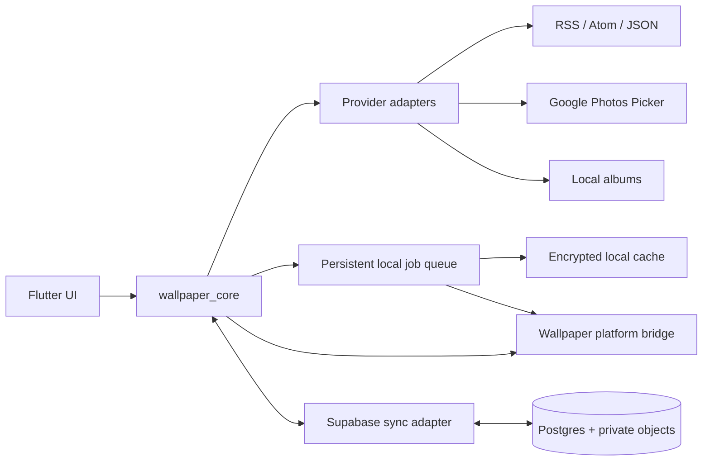

# Wallpaper architecture

## Design principles

The application is local-first: browsing local folders, building schedules, and applying cached wallpapers do not require an account. Authentication adds synchronization and private Google Photos copies. A shared Flutter UI owns presentation and orchestration; native helpers own operating-system behavior.

## Components

## Platform boundaries

| Platform | Static | Video | Automatic rotation | Targets |
| --- | --- | --- | --- | --- |
| macOS | Yes | Native helper | Yes | Desktop, supported lock-screen behavior |
| Windows | Yes | Native helper | Yes | Desktop/per-monitor |
| Android | Yes | Live wallpaper service | Yes | Home and supported lock screen |
| iOS | Yes | No in v1 | User-triggered | Home/lock via Shortcuts handoff |

Capability discovery is runtime data. The UI disables unsupported actions and displays the platform explanation supplied by the native service.

## Data and privacy contracts

- Feed providers accept HTTPS only, enforce time and size limits, block private network destinations, follow a bounded redirect policy, and validate response media types.
- Google Photos uses the Picker API. Selected items are copied, with consent, to per-user private object storage because source URLs are not durable cross-device media identifiers.
- Local album files never leave their originating device. A local source is scoped to `deviceId` and excluded from cloud media upload.
- Cloud rows use stable IDs, `updatedAt`, and tombstones. Last-write-wins resolves configuration conflicts; media objects are deduplicated by content hash within a user boundary.
- OAuth and source secrets remain in platform secure storage. Object downloads use short-lived signed URLs.

## Delivery slices

1. Shared core and responsive shell.
2. Local albums, static wallpaper bridges, cache, and persistent jobs.
3. RSS/Atom/JSON ingestion and rotation schedules.
4. Optional accounts, Supabase sync, and Google Photos import.
5. Desktop/Android video helpers and iOS Shortcuts handoff.
